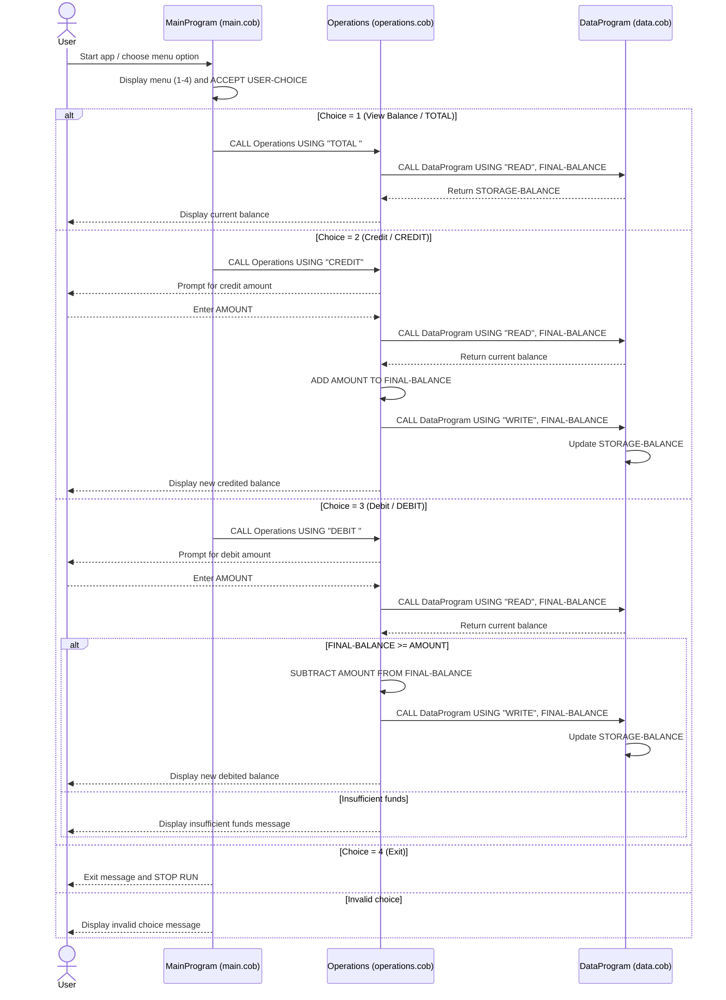

# COBOL Student Account System Documentation

## Overview
This COBOL application is a simple student account management system with three modules:
- `main.cob` for user interaction and menu control
- `operations.cob` for account transaction logic
- `data.cob` for balance storage and read/write access

The system supports:
- Viewing current balance
- Crediting an account
- Debiting an account (with insufficient-funds protection)

## File Purposes

### `src/cobol/main.cob`
**Program ID:** `MainProgram`

**Purpose:**
- Entry point of the application
- Presents a text-based menu to the user
- Routes user choices to the business logic module

**Key logic:**
- Uses `USER-CHOICE` to capture menu selections (`1-4`)
- Loops until the user selects Exit (`4`)
- Calls `Operations` with an operation code:
  - `TOTAL ` for balance inquiry
  - `CREDIT` for adding funds
  - `DEBIT ` for subtracting funds

### `src/cobol/operations.cob`
**Program ID:** `Operations`

**Purpose:**
- Implements transaction logic for the student account
- Coordinates between user input and persisted account balance

**Key logic:**
- Receives operation type via linkage parameter `PASSED-OPERATION`
- For `TOTAL `:
  - Calls `DataProgram` with `READ`
  - Displays the current balance
- For `CREDIT`:
  - Accepts credit amount from user
  - Reads current balance from `DataProgram`
  - Adds credit amount
  - Writes updated balance back with `WRITE`
- For `DEBIT `:
  - Accepts debit amount from user
  - Reads current balance from `DataProgram`
  - Performs a funds check before subtraction
  - Writes updated balance only when sufficient funds are available

### `src/cobol/data.cob`
**Program ID:** `DataProgram`

**Purpose:**
- Stores and serves the account balance
- Provides a small read/write interface to other modules

**Key logic:**
- Maintains in-memory balance in `STORAGE-BALANCE`
- Receives operation code (`READ` or `WRITE`) and a balance field
- On `READ`: returns `STORAGE-BALANCE`
- On `WRITE`: updates `STORAGE-BALANCE` with provided value

## Key Functions and Inter-Module Flow
1. `MainProgram` captures menu choice.
2. `MainProgram` calls `Operations` with operation code.
3. `Operations` calls `DataProgram` to read/update account balance.
4. `Operations` displays result messages to the user.

This design separates:
- UI/menu handling (`main.cob`)
- Transaction/business logic (`operations.cob`)
- Data access/state (`data.cob`)

## Student Account Business Rules
- The account starts with a default balance of `1000.00`.
- Valid menu options are only `1`, `2`, `3`, and `4`.
- A credit transaction always increases current balance by entered amount.
- A debit transaction is allowed only if `current balance >= debit amount`.
- If funds are insufficient, balance is unchanged and an error message is shown.
- Balance updates occur through `DataProgram` write calls, not directly in `MainProgram`.

## Notes and Limitations
- Balance is kept in working storage (in-memory), so it does not persist across separate program executions.
- There is no validation for negative, zero, or non-numeric transaction amounts beyond COBOL field typing.
- The current implementation represents a single account context.

## Sequence Diagram (Data Flow)

